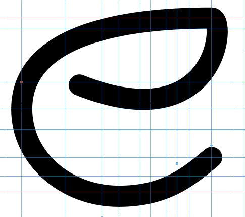
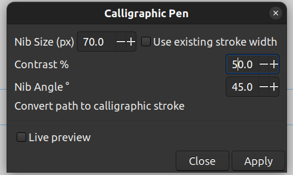
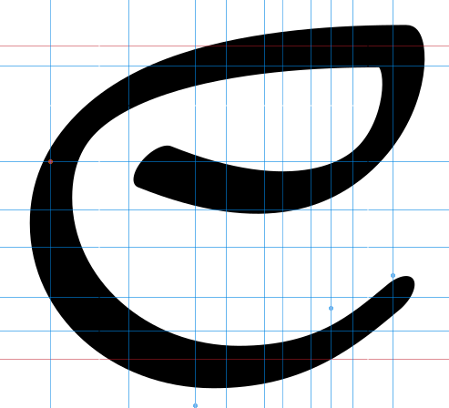
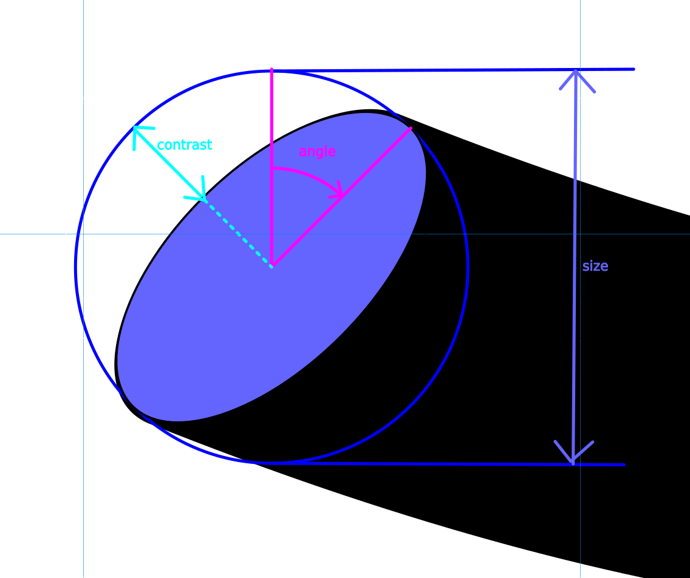

# Calligraphic Pen

## Installation

1. Copy all the python (`*.py`) and inkex (`*.inx`) files from this directory to your inkscape user
extensions directory. You can find this in `Edit>Preferences>System>User EXtensions`.
2. [Re-]start Inkscape.

## Description

This package contains two extensions, the second one uses the first.
The first extension is a simple calligraphic stroke effect with an oval nib
that is applied to any selected paths.

The second is intended to work with the existing Inkscape Typography extension.
It applies that same calligraphic stroke to all paths, groups and clones in the
`GlyphLayer-*` layers created by that extension, in a non-destructive manner.

### 1. Calligraphic Pen Extension

After installation it is found in `Extensions>Calligraphy>Calligraphic Pen`.

To use, first select a path (it must be a path, not a group, object or clone),
for example I have this letter "e":

Open `Extensions>Calligraphy>Calligraphic Pen` and the following dialog box should appear

With your path selected, you can check the live preview button to see what it will do.
When you are happy hit Apply. For the settings above, my result looks like this:

The various parameters are hopefully self-explanatory but here's a picture anyway:

If you have different paths of different widths, and you want to preserve those, you can check
"use existing stroke width" and it will skip the step where it assigns the nib size
to the path stroke width.

### 2. Typography Calligraphic Pen Extension

After installation, this can be found in `Extensions>Typography>Calligraphic Pen`

The dialog box for this extension is identical to the Calligraphic Pen dialog shown above,
except there is no live preview option.
As mentioned, this is intended to work seamlessly with the "Typography" extension that is
bundled with Inkscape.

To recap, that pre-bundled Typography extension will create separate layers for each character that
you want to create, each with a prefix `GlyphLayer-`, so `GlyphLayer-A`, `GlyphLayer-B` etc. You
start by drawing your characters in those layers.

What this Typography Calligraphic Pen Extension does is, for each `{char}`:

1. Rename `GlyphLayer-{char}` to `Original-GL-{char}`.
2. Copy the `Original-GL-{char}` to `GlyphLayer-{char}`. 
3. Inline all the underlying paths in `GlyphLayer-{char}`.
4. Apply the calligraphic pen effect to each path in `GlyphLayer-{char}`.

However, if there is already an `Original-GL-{char}` layer it will instead assume it has been
run before, delete any equivalent `GlyphLayer-{char}`, then skip to step 2. Likewise, if there is
an `Original-GL-{char}` with no `GlyphLayer-{char}`, it just skips to step 2.

#### TL;DR
You can continue to edit your characters but in their new `Original-GL-` layers.
You can re-run the extension as many times as you like to update the `GlyphLayer-` layers.
You can even create more `GlyphLayer-` layers, new ones will be detected and backed up before
being updated.
You can use groups, objects and clones in your `Original-GL-` layers, they will be inlined to
bare paths in the `GlyphLayer-` layers before the effect is applied.
