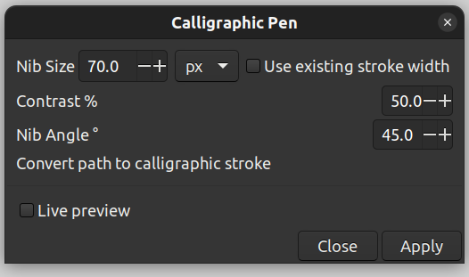

# Calligraphic Pen

## Installation

1. Copy all the python (`*.py`) and inkex (`*.inx`) files from this directory to your inkscape user
extensions directory. You can find this in `Edit>Preferences>System>User EXtensions`.
2. [Re-]start Inkscape.

## Description

This package contains two extensions, the second one uses the first.
The first extension is a simple calligraphic stroke effect with an oval nib
that is applied to any selected paths.

The second is intended to work with the existing Inkscape Typography extension.
It applies that same calligraphic stroke to all paths, groups and clones in the
`GlyphLayer-*` layers created by that extension, in a non-destructive manner.

### Calligraphic Pen Extension

After installation it is found in `Extensions>Calligraphy>Calligraphic Pen`.

To use, first select a path, for example I have this letter "e":

Open `Extensions>Calligraphy>Calligraphic Pen` and the following dialog box should appear

With your path selected, you can check the live preview button to see what it will do.
When you are happy hit Apply. For the settings above, my result looks like this:

The various parameters are hopefully self-explanatory but here's a picture anyway:

If you have different paths of different widths, and you want to preserve those, you can check
"use existing stroke width" and it will skip the step where it assigns the nib size
to the path stroke width.

### Typography Calligraphic Pen Extension

After installation, this can be found in `Extensions>Typography>Calligraphic Pen`

The dialog box for this extension is identical to the Calligraphic Pen dialog shown above,
except there is no live preview option.
As mentioned, this is intended to work seamlessly with the "Typography" extension that is
bundled with Inkscape.

To recap, the pre-bundled Typography extension will create separate layers for each character that
you want to create, each with a prefix `GlyphLayer-`, so `GlyphLayer-A`, `GlyphLayer-B` etc. You
start by drawing your characters in those layers.

What this Calligraphic Pen Typography Extension does is to:

1. rename each of the `GlyphLayer-` layers to equivalent `Original-GL-` layers.
2. copy those backups back over the `GlyphLayer-` layers. 
3. inline all the underlying paths in the new `GlyphLayer-` layers, ungrouping groups,
uncloning clones and converting objects to paths.
4. apply the Calligraphic Pen effect to each path in those layers.

If it finds a pre-existing `Original-GL-` layer it will instead assume it has been run before,
delete any equivalent `GlyphLayer-` layer, then skip to step 2.

#### TL;DR
After running the extension you can continue to edit your characters, but now in their
`Original-GL-` layers. Every time you run it, it will delete then re-create the `GlyphLayer-`
layers and apply the effect, so any changes you make in a `GlyphLayer-` which already has an
`Original-GL-` will be lost. You should consider those `GlyphLayer-` layers as read-only.

If you want to add more characters later, you can still use the Typography extension
to create new `GlyphLayer-` layers, or you can create new `Original-GL-` layers manually.
Either way the extension should be well-behaved: it will never make changes to an existing
`Original-GL-` layer and it will never make changes to a `GlyphLayer-` layer without
first ensuring there is an `Original-GL-` layer for it.

You can also use the Calligraphic Pen effect individually on your `Original-GL-`
glyphs to see how they will look.